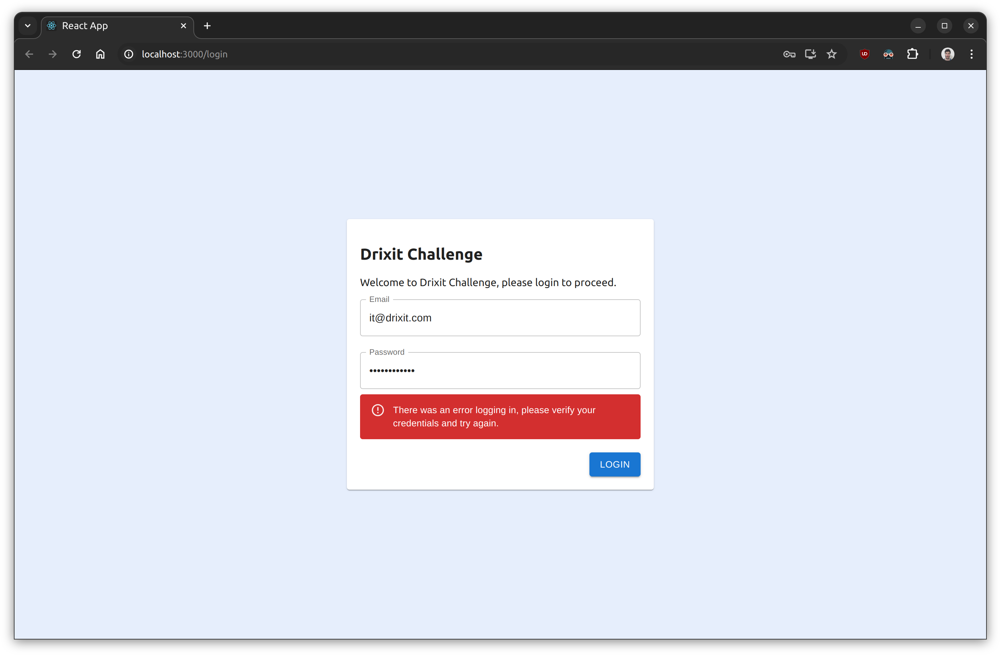

# Drixit Challenge

## Intro

This repository contains a project that aims to fullfil Drixit's Fullstack Developer challenge (described in [this repository](https://github.com/drixit/challenge))

The challenge requires a fullstack application (frontend and backend) which presents a login page to a user, allows them to authenticate and then shows them their profile information.

On the other side, the backend that's responding to the frontend's requests, has 2 endpoints, one for authenticating and one for return a user's profile info.

As the challenge requirements are non restrictive, the developer (me) is tasked with making some decisions regarding the implementation of both parts of the app.

The decisions made are the following:

### Backend

- Developed with ExpressJS for faster development and better routing management
- Used Typescript for enhanced developer experience, maintainability and to reduce potential errors
- Used dotenv for environment variables storing
- Used JWTs for session management
- Used MongoDB as the backend database with Mongoose as an ORM for better and cleaner data management

### Frontend

- Developed with React on a project created with `create-react-app`
- Used Typescript for enhanced developer experience, maintainability and to reduce potential errors
- Used React Router for page routing, navigation and history management
- Used MUI (Material UI) for React to simplify the UX/UI development and have a consistent and elegant site

## Requirements

To run the project, there's a few items that need to be installed.

- NodeJS (The version used for developing the challenge is the lts version, 20.11.1)
- `npm`
- MongoDB

There are various ways to install the required software, I'll explain below the steps I took to install my setup.

### NodeJS and npm

For Node and npm (and other programming environments) I use [asdf](https://asdf-vm.com/) which is a very handy multi-stack version manager (something like `nvm`) and I would recommend anyone to try it.

Once `asdf` is installed (installation steps vary from platform to platform):

```shell
asdf plugin add nodejs
asdf install nodejs lts
asdf global nodejs lts

# Then check the installation was successful with:

$ node --version
v20.11.1

$ npm --version
10.2.4
```

### Install MongoDB

For Mongo, I'm using [Docker](https://www.docker.com/) as it's very easy to setup and pretty simple to manage.

Once `docker` is installed (installation steps vary from platform to platform):

```shell
docker run -it --name drixit-challenge-db -d mongo:latest -p 27017:27017
```

- If the image hasn't been downloaded before, Docker will fetch it automatically
- The container name can be changed to other value. Just remember to match it to the config later
- The port that exposes the mongo database can be changed to another one. Just remember to match it to the config later

Once the above steps are completed, it's time to move on to the next stage: Running the project

## Running the project

To run the project, do the following:


Fetch the project:

```shell
git clone https://github.com/ivaneidel/drixit-challenge
```

### Backend

Get your local MongoDB URI, it should look something like `mongodb://localhost:27017/drixit-challenge-db`.

Install dependencies and create the `.env` file

```shell
cd drixit-challenge/backend

npm install

cp env.example .env
```

Edit the `.env` file and define the mongodb URI correctly.

Seed the database

```shell
npm run seed-db
```

You should see something like:

```shell
HASH_SALT=[REDACTED]
JWT_SECRET=[REDACTED]
```

Copy those secrets as they are and put them in the `.env` file.

The `HASH_SALT` is used for hashing user's passwords on the database and it's re-generated every time the `seed-db` script is run to avoid using a fixed salt which would decrease the database security considerably.

The `JWT_SECRET` is used for signing the JWT tokens to prevent attackers from forging the tokens and gaining access to the system.

Once the setup is done, the backend can be run:

```shell
npm run build
npm start

# For development
npm run dev
```

A message indicating the app is running on port 5000 should appear

### Frontend

Make sure the backend app is running, then do:

```shell
cd drixit-challenge/frontend

npm install

npm start
```

The browser should open on http://localhost:3000 where the frontend should be displayed.

## Screenshots

A few screenshots to showcase the app:

### Login




### Profile


### Invalid credentials

